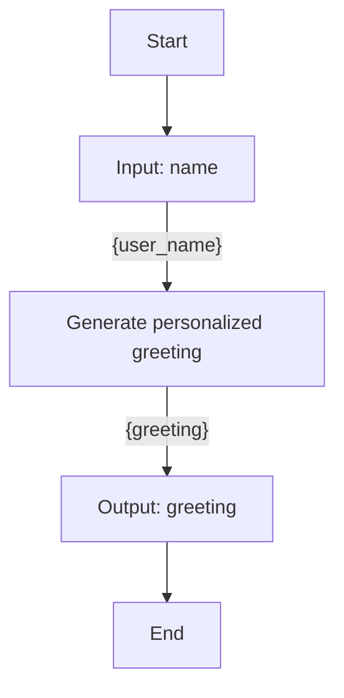

# Workflow Generator

**File:** `poc-dsl-compiler/workflow_generator.py`

Random workflow JSON generator used for fuzz-testing the DSL compiler pipeline. Produces a structured, valid Workflow JSON document and a corresponding Mermaid diagram on each run.

---

## How to Run

```bash
cd poc-dsl-compiler
python3 workflow_generator.py
```

Output:
```
Difficulty Levels:
  1  Linear   — START to INPUT to ACTION to OUTPUT to END
  2  Branches — 2 parallel branches from shared INPUT
  3  Branches — 3 parallel branches from shared INPUT
  4  Deep     — 2 branches with chained ACTIONs (INPUT to ACTION to ACTION to OUTPUT)
  5  Mixed    — 2 branches of different depths, branch 2 has its own INPUT
  6  Wait     — Linear with WAIT(duration) between ACTION and OUTPUT
  7  Wait+    — 2 branches with WAIT(duration); branch 1 has an extra ACTION after the WAIT
  8  Listen   — Linear with WAIT(listen): waits for an external signal before OUTPUT
  9  Mixed W  — 2 branches: branch A uses WAIT(duration), branch B uses WAIT(listen)

Difficulty Level (1-9):
```

The generator prompts for a level, then writes two files:

| Output | Directory | File name |
|---|---|---|
| Mermaid diagram | `poc-dsl-compiler/input/workflows/` | `workflow_N.md` |
| Workflow JSON | `poc-dsl-compiler/input/workflow_outputs/` | `workflow_N_output.json` |

Where `N` is auto-incremented based on existing files in `input/workflows/`.

> **NOTE:** Generator writes directly to the compiler's input directory. Run `python3 poc-dsl-compiler/main.py workflow_N_output` to compile after generating.

---

## Generation Flow

```
GENERATORS[level]()      — produces raw workflow dict {nodes, edges}
        ↓
shuffle_nodes(workflow)  — randomly shuffles the nodes array in-place
        ↓
get_next_index()         — scans input/workflows/ for workflow_N.md, returns max+1 (or 1 if empty)
        ↓
generate_mermaid(workflow) — builds fenced mermaid string from edges and node labels
        ↓
save_workflow(workflow, mermaid, index) — writes .md + _output.json to their directories
```

---

## Vocabulary Tables

Vocabulary lists provide semantically realistic randomized content. Builders always use `random.choice()` or `random.sample()` from these tables — no free-form string generation.

### INPUT_VOCAB (10 entries)

| `field` | `store_as` | Human label |
|---|---|---|
| `name` | `user_name` | user name |
| `email` | `user_email` | email address |
| `date_of_birth` | `dob` | date of birth |
| `product_id` | `product_id` | product ID |
| `order_id` | `order_id` | order ID |
| `location` | `user_location` | location |
| `phone_number` | `phone` | phone number |
| `user_id` | `user_id` | user ID |
| `city` | `city` | city |
| `country` | `country` | country |

### ACTION_VOCAB (14 entries)

| `operation` | `output` | Human label |
|---|---|---|
| `greet` | `greeting` | Generate personalized greeting |
| `validate_email` | `validation_result` | Validate email address |
| `calculate_age` | `age` | Calculate age from date of birth |
| `fetch_product` | `product_details` | Fetch product details |
| `process_order` | `order_status` | Process order |
| `send_notification` | `notification_status` | Send notification to user |
| `lookup_location` | `location_data` | Look up location data |
| `verify_phone` | `phone_verified` | Verify phone number |
| `generate_report` | `report` | Generate user activity report |
| `log_activity` | `log_id` | Log user activity |
| `enrich_profile` | `enriched_profile` | Enrich user profile |
| `score_risk` | `risk_score` | Score risk |
| `send_email` | `email_status` | Send email to user |
| _(13th entry)_ | — | — |

### WAIT_VOCAB (10 entries)

Each entry has exactly one time-unit key plus a `label` key (human display only; never in generator output):

| Time unit | Value | Label |
|---|---|---|
| `seconds` | 10 | 10 seconds |
| `seconds` | 30 | 30 seconds |
| `seconds` | 60 | 60 seconds |
| `minutes` | 1 | 1 minute |
| `minutes` | 2 | 2 minutes |
| `minutes` | 5 | 5 minutes |
| `minutes` | 10 | 10 minutes |
| `minutes` | 15 | 15 minutes |
| `hours` | 1 | 1 hour |
| `hours` | 2 | 2 hours |

### LISTEN_VOCAB (4 entries)

Each entry has a `signal` key (the Temporal signal name) plus a `label` key (human display only; never in generator output):

| `signal` | Label |
|---|---|
| `user_confirmation` | User confirmation received |
| `payment_completed` | Payment completed |
| `notification_ack` | Notification acknowledged |
| `approval_received` | Approval received |

---

## Node Builder Functions

All builders are pure, module-level functions. No classes. No side effects.

### `make_start(nid)`
```json
{ "id": "N1", "type": "START" }
```

### `make_end(nid)`
```json
{ "id": "N5", "type": "END" }
```

### `make_input(nid, fields)`
`fields`: list of `INPUT_VOCAB` entries.
```json
{
  "id": "N2",
  "type": "INPUT",
  "data": {
    "inputs": [
      { "field": "name", "store_as": "user_name", "type": "string" }
    ]
  }
}
```
Multiple fields are supported — all become entries in the `inputs` array.

### `make_action(nid, operation, input_var, output_var)`
`input_var`: the runtime variable name (e.g., `user_name` from a prior INPUT `store_as`).
```json
{
  "id": "N3",
  "type": "ACTION",
  "data": {
    "operation": "greet",
    "inputs": { "value": "user_name" },
    "output": "greeting"
  }
}
```

### `make_output(nid, fields)`
`fields`: list of `{"field": str, "type": "string"}` dicts.
```json
{
  "id": "N4",
  "type": "OUTPUT",
  "data": {
    "outputs": [
      { "field": "greeting", "type": "string" }
    ]
  }
}
```

### `make_wait_duration(nid, duration)`
`duration`: one entry from `WAIT_VOCAB`. Extracts the single time-unit key by excluding `"label"`.
```json
{
  "id": "N4",
  "type": "WAIT",
  "data": {
    "mode": "duration",
    "config": { "minutes": 5 }
  }
}
```
**Rule:** The `label` key from `WAIT_VOCAB` is never included in the output. Only one time-unit key is present in `config` (`seconds`, `minutes`, or `hours`).

### `make_wait_listen(nid, listen)`
`listen`: one entry from `LISTEN_VOCAB`.
```json
{
  "id": "N4",
  "type": "WAIT",
  "data": {
    "mode": "listen",
    "config": { "signal": "approval_received" }
  }
}
```
**Rule:** The `label` key from `LISTEN_VOCAB` is never included in the output. Only the `signal` key is present in `config`.

### `make_edge(eid, src, tgt)`
```json
{ "id": "E1", "source": "N1", "target": "N2" }
```
Edges carry no business data — only `id`, `source`, `target`.

---

## Node ID Convention

- Node IDs: `N{int}` starting from `N1`, assigned sequentially by topological position within each generator function.
- Edge IDs: `E{int}` starting from `E1`, assigned in order of definition within each generator function.

---

## `shuffle_nodes(workflow)`

Shuffles `workflow["nodes"]` in-place using `random.shuffle()`. Edges are never touched.

**Why:** The compiler must not rely on the positional order of nodes in the `nodes` array to determine execution order. Only edges (`source` → `target`) define control flow. Shuffling enforces this constraint during fuzz-testing: any compiler bug that relies on array position will surface immediately.

---

## `get_next_index()`

Scans `poc-dsl-compiler/input/workflows/` for files matching `workflow_N.md`. Returns `max(N) + 1`, or `1` if no files exist.

**Rule:** Never overwrites existing files. Each generator run produces a new file pair.

---

## Difficulty Levels — Topology Reference

| Level | Name | Nodes | Edges | Shape |
|---|---|---|---|---|
| 1 | Linear | 5 | 4 | `START → INPUT → ACTION → OUTPUT → END` |
| 2 | Branches | 7 | 7 | Shared INPUT → 2×(ACTION → OUTPUT) → END |
| 3 | Branches | 9 | 10 | Shared INPUT → 3×(ACTION → OUTPUT) → END |
| 4 | Deep | 9 | 9 | Shared INPUT → 2×(ACTION → ACTION → OUTPUT) → END |
| 5 | Mixed | 10 | 10 | START → separate INPUTs; branch 1: shallow; branch 2: own INPUT → 3-action chain |
| 6 | Wait | 6 | 5 | `START → INPUT → ACTION → WAIT(duration) → OUTPUT → END` |
| 7 | Wait+ | 10 | 10 | Shared INPUT → branch1: ACTION→WAIT(duration)→ACTION→OUTPUT; branch2: ACTION→WAIT(duration)→OUTPUT → END |
| 8 | Listen | 6 | 5 | `START → INPUT → ACTION → WAIT(listen) → OUTPUT → END` |
| 9 | Mixed W | 9 | 9 | Shared INPUT → branch A: ACTION→WAIT(duration)→OUTPUT; branch B: ACTION→WAIT(listen)→OUTPUT → END |

### Level 6 — exact structure
```
START(N1) → INPUT(N2) → ACTION(N3) → WAIT(duration)(N4) → OUTPUT(N5) → END(N6)
Edges: E1(N1→N2) E2(N2→N3) E3(N3→N4) E4(N4→N5) E5(N5→N6)
```

### Level 7 — exact structure
```
START(N1) → INPUT(N2) with 2 fields
  Branch 1: INPUT(N2)→ACTION(N3)→WAIT(duration)(N4)→ACTION(N5)→OUTPUT(N6)→END(N10)
  Branch 2: INPUT(N2)→ACTION(N7)→WAIT(duration)(N8)→OUTPUT(N9)→END(N10)
Edges: E1(N1→N2), E2(N2→N3), E3(N3→N4), E4(N4→N5), E5(N5→N6), E6(N6→N10)
        E7(N2→N7), E8(N7→N8), E9(N8→N9), E10(N9→N10)
```

### Level 8 — exact structure
```
START(N1) → INPUT(N2) → ACTION(N3) → WAIT(listen)(N4) → OUTPUT(N5) → END(N6)
Edges: E1(N1→N2) E2(N2→N3) E3(N3→N4) E4(N4→N5) E5(N5→N6)
```

### Level 9 — exact structure
```
START(N1) → INPUT(N2) with 2 fields
  Branch A: INPUT(N2)→ACTION(N3)→WAIT(duration)(N4)→OUTPUT(N5)→END(N9)
  Branch B: INPUT(N2)→ACTION(N6)→WAIT(listen)(N7)→OUTPUT(N8)→END(N9)
Edges: E1(N1→N2), E2(N2→N3), E3(N3→N4), E4(N4→N5), E5(N5→N9)
        E6(N2→N6), E7(N6→N7), E8(N7→N8), E9(N8→N9)
```

---

## Mermaid Generation — `generate_mermaid(workflow)`

### Letter assignment
- Sort all node IDs by their integer suffix: `N1 < N2 < N3 …`
- Assign letters A, B, C, … in that sorted order
- `N1 → A`, `N2 → B`, `N3 → C`, etc.

### Output format
```

```

### Node labels — `_node_label(node)`

| Node type | Label rule |
|---|---|
| `START` | `"Start"` |
| `END` | `"End"` |
| `INPUT` | `"Input: {field}"` (single); `"Input: {f1} and {f2}"` (multiple) |
| `ACTION` | Human-readable label from `_OPERATION_LABELS` lookup; falls back to `op.replace("_", " ").title()` |
| `OUTPUT` | `"Output: {field}"` (single); `"Output: {f1} and {f2}"` (multiple) |
| `WAIT` (duration) | `"Wait: N hours/minutes"` (plural if N≠1); `"Wait: N seconds"` |
| `WAIT` (listen) | `"Listen: {signal_name}"` (underscores replaced with spaces, title-cased) |

### Edge labels — `_edge_label(src_node, tgt_node)`

| Source type | Label |
|---|---|
| `START` | `""` (no label) |
| `END` | `""` (no label) |
| `OUTPUT` | `""` (no label) |
| `WAIT` | `""` (no label) |
| `INPUT` (→ACTION) | `{var1, var2}` — variables the target ACTION actually uses |
| `INPUT` (→other) | `""` |
| `ACTION` | `{output_var}` — the ACTION's output variable name |

Edges with a non-empty label render as `A -- {label} --> B`. Edges with empty labels render as `A --> B`.

---

## Workflow Generation Constraints

These rules must hold for every generated workflow. The compiler assumes generator constraints are valid. Traversal behavior may become undefined if constraints are violated. Add explicit validation before relying on these rules in production.

| Rule | Detail |
|---|---|
| Exactly one START | One and only one node with `type: "START"` |
| Exactly one END | One and only one node with `type: "END"` |
| Valid edge endpoints | Every edge `source` and `target` must reference an existing node ID |
| Non-START nodes have ≥1 incoming edge | All nodes except START are reachable |
| Non-END nodes have ≥1 outgoing edge | All non-terminal nodes have a successor |
| Nodes array is unordered | `shuffle_nodes()` is always called; never rely on array position |
| Edges array retains definition order | Edges are not shuffled; order is definition order (not used for traversal) |
| No `label` key in node output | The `label` field in vocab entries is for human display in this file only |
| WAIT duration has exactly one time-unit key | `seconds`, `minutes`, or `hours` — never more than one |
| Node IDs are unique | Each `id` appears in `nodes` exactly once |
| JSON is the source of truth | Mermaid is generated from JSON, not the other way around |

---

## Relationship to the Compiler

The generator is independent of the compiler. It produces valid input JSON that can be fed to the compiler.

```
workflow_generator.py (this file)
        ↓  produces
poc-dsl-compiler/input/workflow_outputs/workflow_N_output.json
        ↓  compiler reads
python3 poc-dsl-compiler/main.py workflow_N_output
        ↓  produces
poc-dsl-compiler/output/workflow_N_output_dsl_schema.json
        ↓  validate
zigflow validate poc-dsl-compiler/output/workflow_N_output_dsl_schema.json
```

**Note:** Generator writes directly to `input/workflow_outputs/`. No manual copy step needed.

---

## Adding a New Difficulty Level

1. Write `generate_level_N()` — pure function, returns `{"nodes": [...], "edges": [...]}`.
2. Document the exact node count, edge count, and shape in the topology table above.
3. Add the entry to the `GENERATORS` dict.
4. Add a human-readable description to the `DESCRIPTIONS` dict.
5. Update the prompt validation: `if level not in GENERATORS: print("Invalid level. Choose 1-N.")`.
6. Update this doc: topology table + level descriptions.

## Adding a New Node Type to the Generator

1. Add vocabulary entries to a new `<TYPE>_VOCAB` list (if randomized content is needed).
2. Write a `make_<type>(nid, ...)` pure builder function.
3. Update `_node_label(node)` to return a human-readable label for the new type.
4. Update `_edge_label(src_node, tgt_node)` to specify what label (if any) to show on edges originating from the new type.
5. Use the new builder in appropriate `generate_level_N()` functions.
6. Update the Vocabulary Tables section and Difficulty Levels section in this doc.
7. **Do not add node types that are not yet implemented in the DSL compiler** — the generator must only produce node types the compiler knows how to handle. See `dsl_compiler.md` V1 Node Types table.
