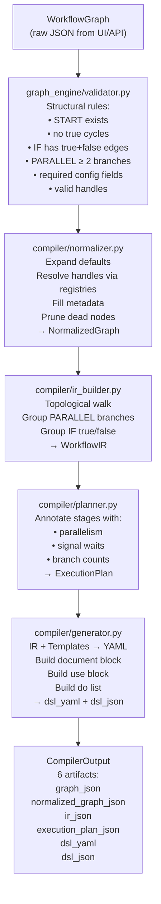
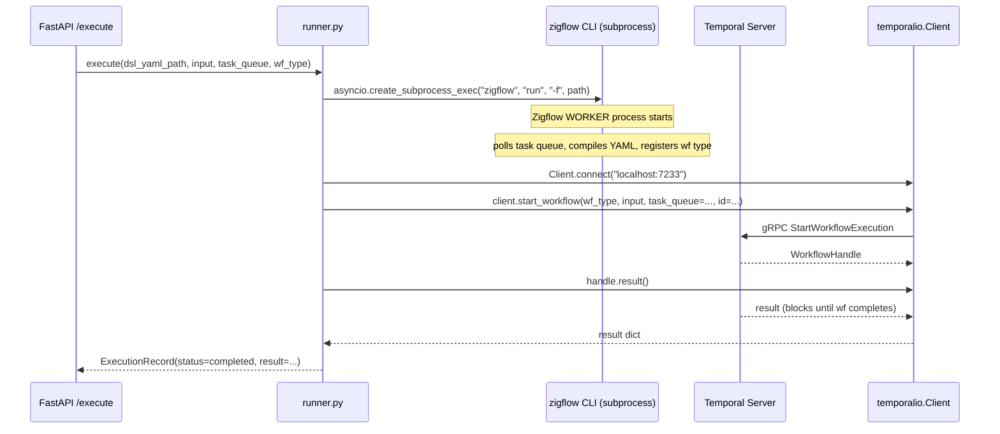
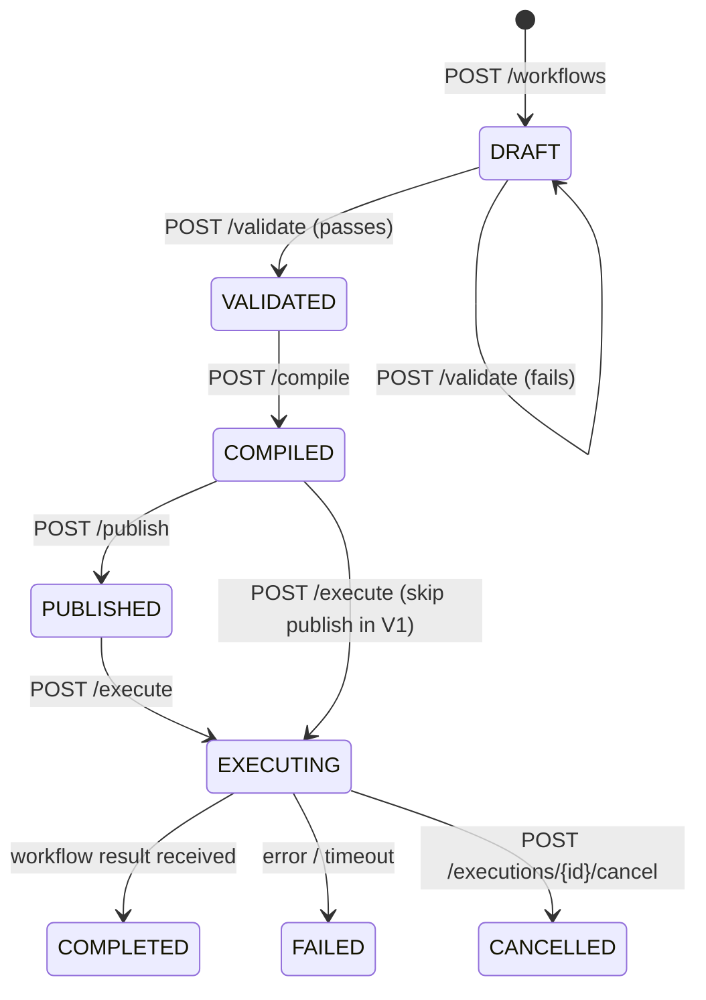

# Workflow Builder Architecture

> **Status:** R&D / Design Phase
> **Scope:** Visual Workflow Builder that compiles a graph into Zigflow YAML executed on Temporal
> **Layer:** `Zigflow-DSL-Compiler/` sits above the Zigflow runtime and below the UI canvas

---

## 1. System Overview

The Visual Workflow Builder is a three-tier system:

```
┌─────────────────────────────────────────────────────┐
│  Tier 1 — UI Layer (V2)                             │
│  ReactFlow canvas · node palette · config panel     │
│  Produces: WorkflowGraph JSON                       │
└────────────────────┬────────────────────────────────┘
                     │ POST /api/v1/workflows
┌────────────────────▼────────────────────────────────┐
│  Tier 2 — Compiler + API Service (V1 focus)         │
│  Validates → Normalizes → IR → Plans → Generates    │
│  Produces: Zigflow YAML + JSON + debug artifacts    │
└────────────────────┬────────────────────────────────┘
                     │ zigflow run (subprocess)
                     │ temporalio.Client.start_workflow()
┌────────────────────▼────────────────────────────────┐
│  Tier 3 — Execution Runtime                         │
│  Zigflow Worker · Temporal Server · Activity Workers│
└─────────────────────────────────────────────────────┘
```

The V1 scope covers **Tier 2** entirely and **Tier 3** partially (execution bridge only).
The UI (Tier 1) is a V2 deliverable; V1 uses raw JSON posted to the API.

---

## 2. Compiler Pipeline

The core of the system is a sequential transformation pipeline. Each stage has a single responsibility and produces a well-typed output that feeds the next stage.



### Stage responsibilities at a glance

| Stage | Input | Output | Fails on |
|---|---|---|---|
| Validator | WorkflowGraph | ValidationResult (errors list) | structural violation |
| Normalizer | WorkflowGraph | NormalizedGraph | unresolvable handle |
| IR Builder | NormalizedGraph | WorkflowIR | unknown node type |
| Planner | WorkflowIR | ExecutionPlan | (never fails — pure annotation) |
| Generator | WorkflowIR + Templates | CompiledDSL | missing template |

**Key design decision:** the Validator runs on the *raw* graph. The Normalizer runs only after validation passes. This keeps validation logic clean and prevents the normalizer from having to handle malformed input.

---

## 3. Component Map

```mermaid
graph LR
    subgraph graph_engine
        GV[validator.py]
        GW[walker.py]
        GR[resolver.py]
        GC[cycle_detector.py]
        GM[models/graph.py]
    end

    subgraph ir
        IM[models.py\nIRTask · WorkflowIR]
    end

    subgraph compiler
        CN[normalizer.py]
        CI[ir_builder.py]
        CP[planner.py]
        CG[generator.py]
        CE[__init__.py\ncompile() entry]
    end

    subgraph registry
        NR[node_registry.py]
        ER[edge_registry.py]
        TR[template_registry.py]
        ND[node_definitions/*.yaml]
        ED[edge_definitions/*.yaml]
        TF[templates/*.yaml]
    end

    subgraph execution
        RN[runner.py\nzigflow subprocess\n+ temporalio SDK]
    end

    subgraph api
        AP[main.py + routes]
        SV[services/]
        ST[storage/]
    end

    GM --> GV
    GM --> GW
    GM --> GR
    GM --> GC
    GW --> GV
    GC --> GV
    NR --> GR
    ER --> GR
    NR --> CN
    ER --> CN
    GV --> CN
    CN --> CI
    IM --> CI
    CI --> CP
    CI --> CG
    TR --> CG
    TF --> TR
    ND --> NR
    ED --> ER
    CE --> GV
    CE --> CN
    CE --> CI
    CE --> CP
    CE --> CG
    AP --> CE
    AP --> RN
    AP --> ST
```

---

## 4. Data Flow with Artifact Storage

Every compile call stores six artifacts in `workflow_versions` to enable:
- debugging (which stage produced the wrong output?)
- diffing across versions
- /simulate without re-compiling
- audit trail

```
POST /api/v1/workflows/{id}/compile
        │
        ▼
compile(WorkflowGraph)
        │
        ├── graph_json              ← raw input stored as-is
        ├── normalized_graph_json   ← post-normalizer output
        ├── ir_json                 ← WorkflowIR (structural, template-free)
        ├── execution_plan_json     ← ExecutionPlan (for /simulate)
        ├── dsl_yaml                ← final Zigflow YAML
        └── dsl_json                ← final Zigflow JSON (same content, different format)
```

---

## 5. Execution Bridge

The execution bridge in `execution/runner.py` has three distinct responsibilities, each using a different mechanism:



**Why `zigflow run` is not replaceable by SDK:**
The Zigflow worker process is what interprets the YAML DSL and converts it into Temporal workflow/activity registrations. There is no Python API for this — `zigflow` is the entry point. Only the *workflow trigger* and *result polling* can use the SDK directly.

---

## 6. Workflow Lifecycle State Machine



---

## 7. API Surface

```
POST   /api/v1/workflows                  create workflow (store graph_json)
GET    /api/v1/workflows                  list all workflows
GET    /api/v1/workflows/{id}             get graph + latest compiled version
PUT    /api/v1/workflows/{id}             update graph → new version row
POST   /api/v1/workflows/{id}/validate    run graph_engine/validator → ValidationResult
POST   /api/v1/workflows/{id}/compile     run full pipeline → CompilerOutput (all 6 artifacts)
POST   /api/v1/workflows/{id}/simulate    return ExecutionPlan.stages (no Temporal call)
POST   /api/v1/workflows/{id}/publish     mark version published
POST   /api/v1/workflows/{id}/execute     start zigflow worker + temporalio.Client.start_workflow

GET    /api/v1/executions/{id}            status + result
POST   /api/v1/executions/{id}/signal     send signal to running workflow
GET    /api/v1/executions/{id}/history    Temporal event history (proxied from SDK)

GET    /api/v1/templates                  list node templates + config schemas
GET    /api/v1/templates/{type}           template schema + example config for a node type
POST   /api/v1/templates                  register custom template (V2)
```

**V1 scope:** All endpoints listed. `/publish` is a status-flag update only (no deployment step in V1).

---

## 8. Key Architectural Decisions

### 8.1 Graph stored as JSONB blob (no node/edge tables)

**Decision:** `workflow_versions.graph_json JSONB` — the entire graph is a single blob.

**Rationale:**
- The graph is always read and written as a whole unit (no queries that filter on individual nodes)
- Normalized relational node/edge tables would add join complexity with zero benefit in V1
- The graph schema evolves frequently in R&D; a blob avoids migration churn per schema change
- Debug artifacts (`normalized_graph_json`, `ir_json`, etc.) are also blobs for the same reason

**Risk:** Large graphs (V2 — 100+ nodes) could create large blobs. Mitigation: Postgres JSONB with GIST indexes if needed in V2.

### 8.2 Compiler is stateless

The `compile(WorkflowGraph)` function is a pure transformation: same input always produces the same output. It holds no database state. The API service layer is responsible for persistence.

**Benefit:** The compiler can be tested in isolation without a database or Temporal server.

### 8.3 Registries are data-driven

Node behavior, edge validity, and DSL template structure are driven entirely by YAML files in `registry/`. Adding a new node type in V2 requires:
1. Add `registry/node_definitions/new_type.yaml`
2. Add `templates/new_type.yaml`
3. Zero compiler code changes

**Risk:** Complex node types (IF, PARALLEL) require special-case handling in `ir_builder.py` and `generator.py` that cannot be fully driven by YAML. V1 accepts this limit; it is documented in `compiler_design.md`.

### 8.4 START and END are graph anchors — not Zigflow tasks

START and END nodes define the entry and exit of the graph for validation and traversal. They emit no Zigflow tasks in the generated DSL. The first non-anchor node reachable from START becomes the first item in the `do` list.

### 8.5 Template-agnostic IR

The IR (`WorkflowIR`) knows nothing about Zigflow syntax. It is a structural description of tasks, their ordering, and their nesting. This allows the generator to swap templates without touching the IR builder, and allows the IR to be used for non-Zigflow backends in V3+.

---

## 9. Unknowns at This Stage

| Unknown | Impact | Required before |
|---|---|---|
| Zigflow worker startup time — how long does `zigflow run` take before it is ready to accept tasks? | Execution bridge timing; may need a readiness poll | Step 11 |
| Zigflow switch task exact DSL structure — the DSL spec for switch/case nesting is not fully documented | Generator for IF nodes | Step 7 |
| Zigflow fork branch result structure — `compete: false` returns an array; shape is unspecified | Generator + IR for PARALLEL nodes | Step 7 |
| Maximum supported graph size before Web UI performance degrades | V2 UI design | V2 |
| Signal delivery ordering guarantees in Zigflow (are signals queued or last-one-wins?) | WAIT mode:signal node behavior | Step 11 |
| Alembic + aiosqlite compatibility with SQLAlchemy 2.0 async — known rough edges | Storage layer | Step 9 |

---

## 10. Out of Scope (V1)

- ReactFlow UI canvas (V2)
- YAML → Graph reverse compilation / `dsl_import/` (V3)
- AI_AGENT, HUMAN_APPROVAL, LOOP node types (V2)
- Multi-tenant namespaces
- Authentication on the API
- Collaborative editing
- MCP tool integration
