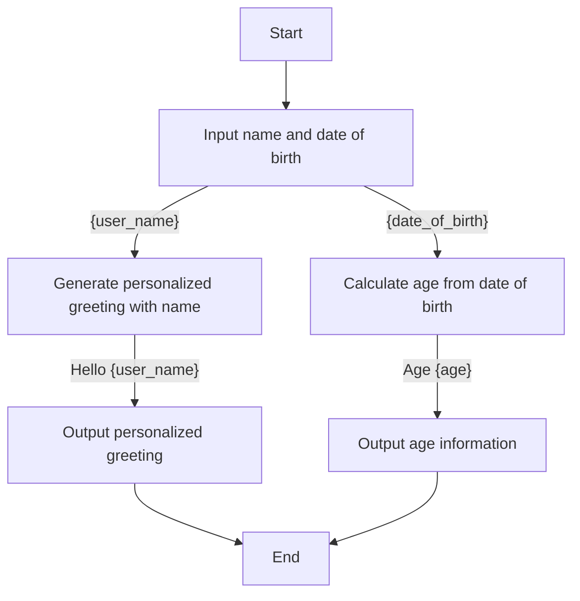

```mermaid
graph TD
    A[Start] --> B[Input name and date of birth]
    B -- {user_name} --> C[Generate personalized greeting with name]
    B -- {date_of_birth} --> D[Calculate age from date of birth]
    C -- Hello {user_name} --> E[Output personalized greeting]
    D -- Age {age} --> F[Output age information]
    E --> G[End]
    F --> G[End]
```
