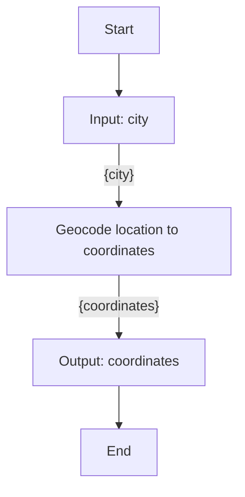

```mermaid
graph TD
    A[Start] --> B[Input: city]
    B[Input: city] -- {city} --> C[Geocode location to coordinates]
    C[Geocode location to coordinates] -- {coordinates} --> D[Output: coordinates]
    D[Output: coordinates] --> E[End]
```