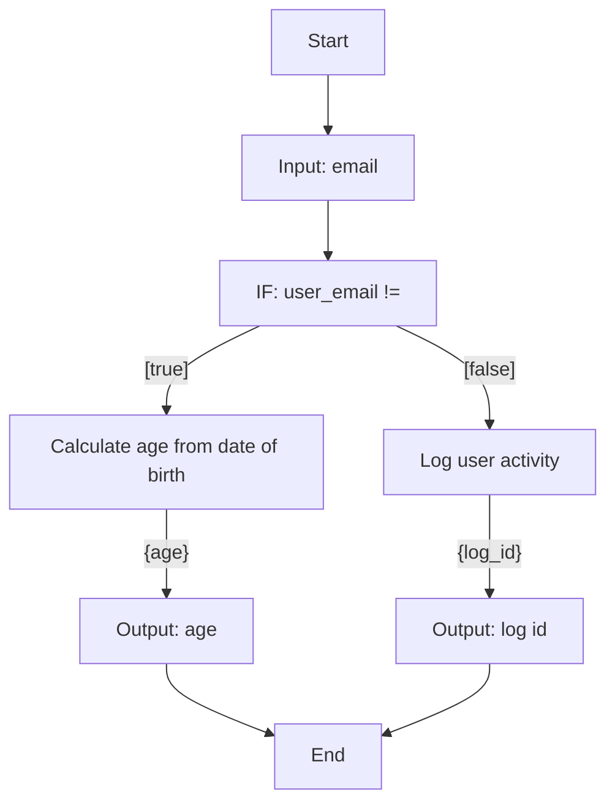

```mermaid
graph TD
    A[Start] --> B[Input: email]
    B[Input: email] --> C[IF: user_email != ]
    C[IF: user_email != ] -- [true] --> D[Calculate age from date of birth]
    C[IF: user_email != ] -- [false] --> F[Log user activity]
    D[Calculate age from date of birth] -- {age} --> E[Output: age]
    E[Output: age] --> H[End]
    F[Log user activity] -- {log_id} --> G[Output: log id]
    G[Output: log id] --> H[End]
```