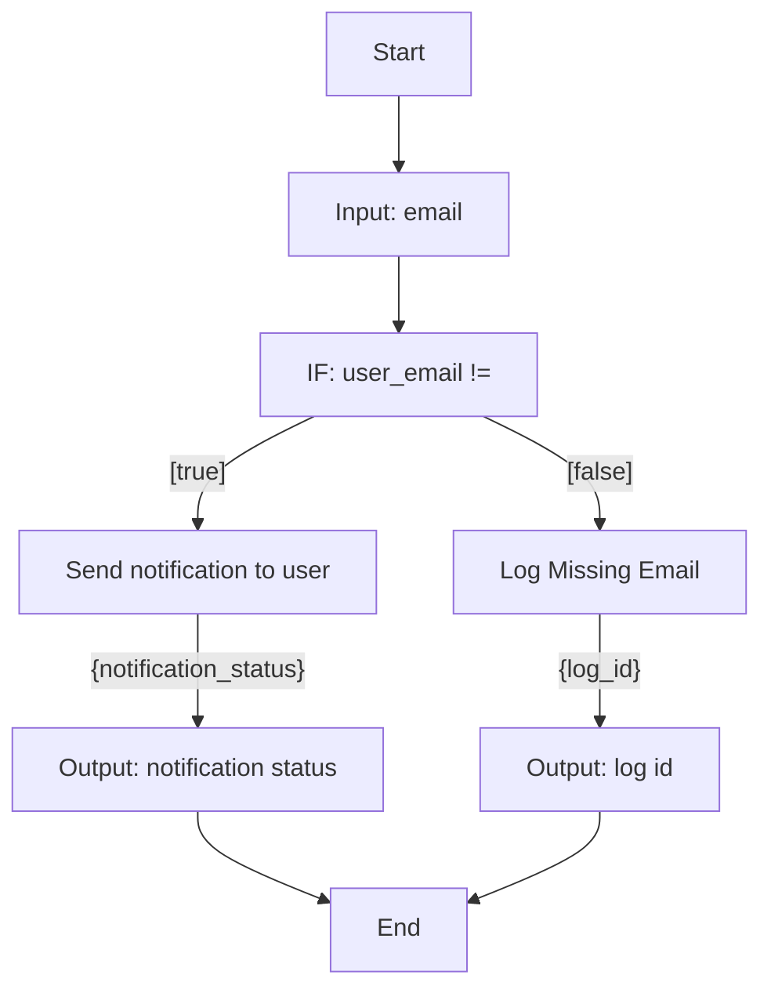

```mermaid
graph TD
    A[Start] --> B[Input: email]
    B[Input: email] --> C[IF: user_email != ]
    C[IF: user_email != ] -- [true] --> D[Send notification to user]
    C[IF: user_email != ] -- [false] --> F[Log Missing Email]
    D[Send notification to user] -- {notification_status} --> E[Output: notification status]
    E[Output: notification status] --> H[End]
    F[Log Missing Email] -- {log_id} --> G[Output: log id]
    G[Output: log id] --> H[End]
```