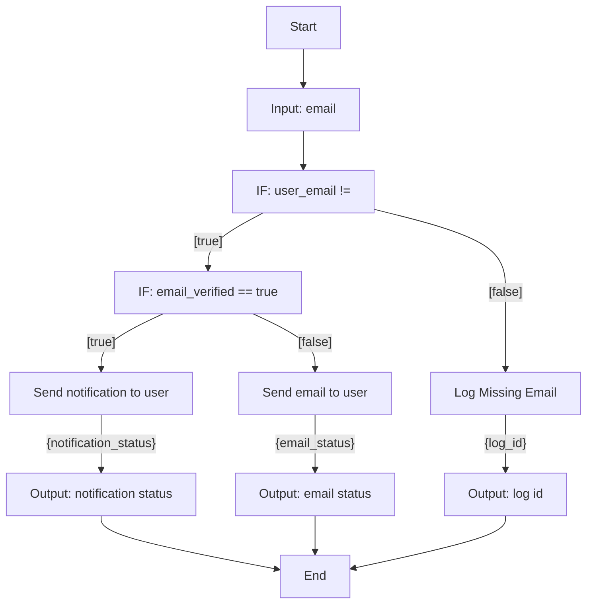

```mermaid
graph TD
    A[Start] --> B[Input: email]
    B[Input: email] --> C[IF: user_email != ]
    C[IF: user_email != ] -- [true] --> D[IF: email_verified == true]
    C[IF: user_email != ] -- [false] --> I[Log Missing Email]
    D[IF: email_verified == true] -- [true] --> E[Send notification to user]
    D[IF: email_verified == true] -- [false] --> G[Send email to user]
    E[Send notification to user] -- {notification_status} --> F[Output: notification status]
    F[Output: notification status] --> K[End]
    G[Send email to user] -- {email_status} --> H[Output: email status]
    H[Output: email status] --> K[End]
    I[Log Missing Email] -- {log_id} --> J[Output: log id]
    J[Output: log id] --> K[End]
```