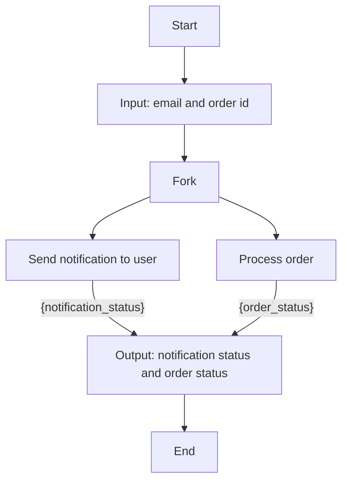

```mermaid
graph TD
    A[Start] --> B[Input: email and order id]
    B[Input: email and order id] --> C[Fork]
    C[Fork] --> D[Send notification to user]
    C[Fork] --> E[Process order]
    D[Send notification to user] -- {notification_status} --> F[Output: notification status and order status]
    E[Process order] -- {order_status} --> F[Output: notification status and order status]
    F[Output: notification status and order status] --> G[End]
```