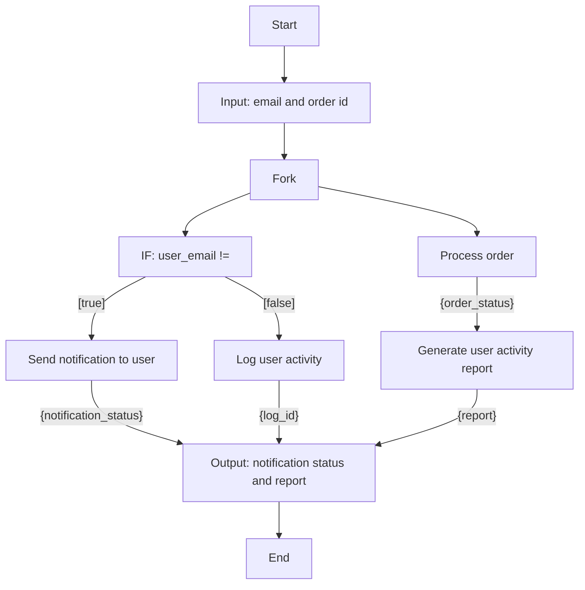

```mermaid
graph TD
    A[Start] --> B[Input: email and order id]
    B[Input: email and order id] --> C[Fork]
    C[Fork] --> D[IF: user_email != ]
    C[Fork] --> G[Process order]
    D[IF: user_email != ] -- [true] --> E[Send notification to user]
    D[IF: user_email != ] -- [false] --> F[Log user activity]
    E[Send notification to user] -- {notification_status} --> I[Output: notification status and report]
    F[Log user activity] -- {log_id} --> I[Output: notification status and report]
    G[Process order] -- {order_status} --> H[Generate user activity report]
    H[Generate user activity report] -- {report} --> I[Output: notification status and report]
    I[Output: notification status and report] --> J[End]
```