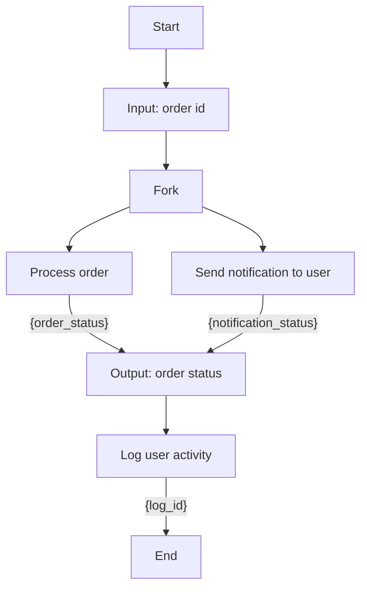

```mermaid
graph TD
    A[Start] --> B[Input: order id]
    B[Input: order id] --> C[Fork]
    C[Fork] --> D[Process order]
    C[Fork] --> E[Send notification to user]
    D[Process order] -- {order_status} --> F[Output: order status]
    E[Send notification to user] -- {notification_status} --> F[Output: order status]
    F[Output: order status] --> G[Log user activity]
    G[Log user activity] -- {log_id} --> H[End]
```