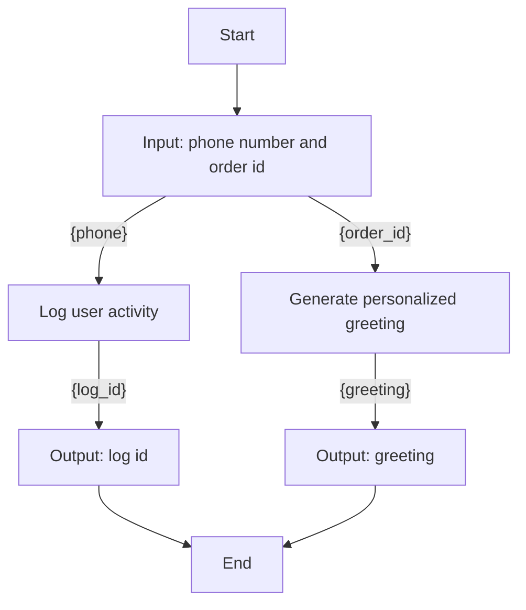

```mermaid
graph TD
    A[Start] --> B[Input: phone number and order id]
    B[Input: phone number and order id] -- {phone} --> C[Log user activity]
    B[Input: phone number and order id] -- {order_id} --> D[Generate personalized greeting]
    C[Log user activity] -- {log_id} --> E[Output: log id]
    D[Generate personalized greeting] -- {greeting} --> F[Output: greeting]
    E[Output: log id] --> G[End]
    F[Output: greeting] --> G[End]
```