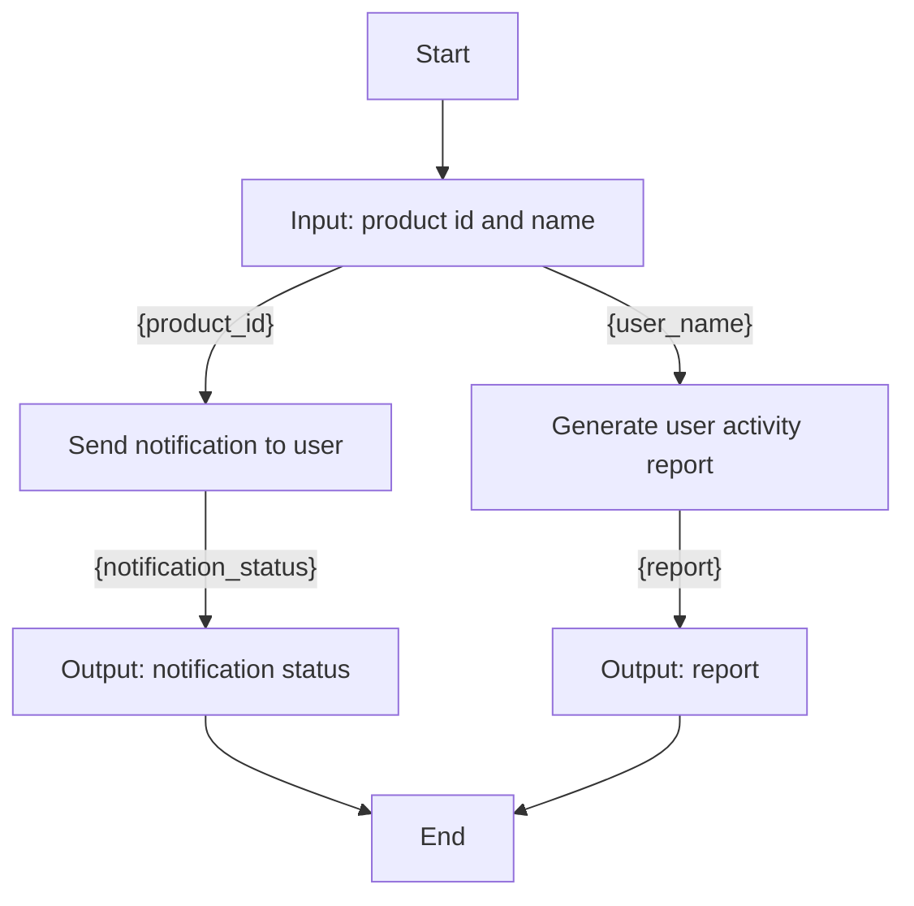

```mermaid
graph TD
    A[Start] --> B[Input: product id and name]
    B[Input: product id and name] -- {product_id} --> C[Send notification to user]
    B[Input: product id and name] -- {user_name} --> D[Generate user activity report]
    C[Send notification to user] -- {notification_status} --> E[Output: notification status]
    D[Generate user activity report] -- {report} --> F[Output: report]
    E[Output: notification status] --> G[End]
    F[Output: report] --> G[End]
```