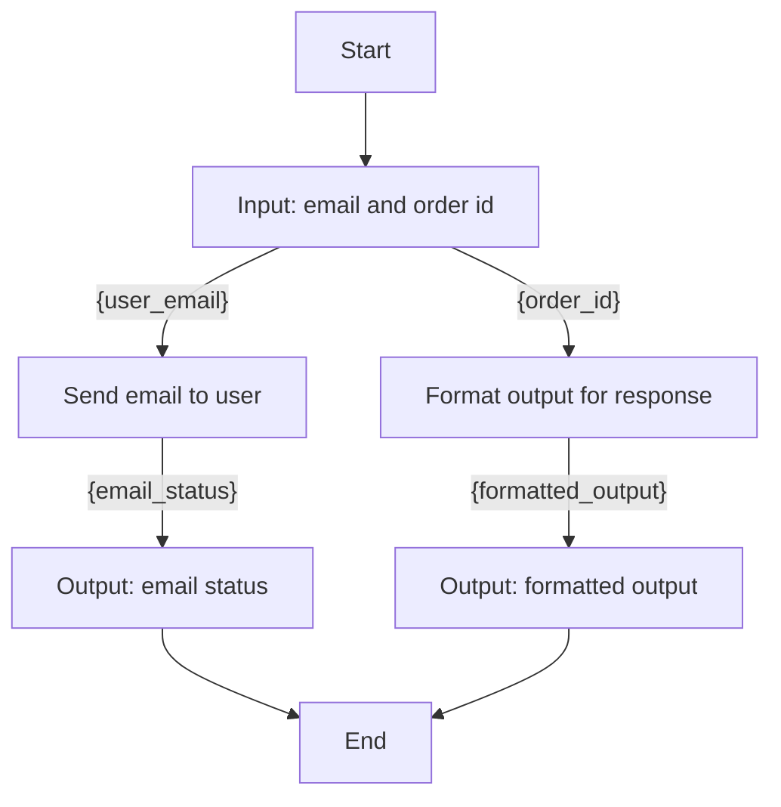

```mermaid
graph TD
    A[Start] --> B[Input: email and order id]
    B[Input: email and order id] -- {user_email} --> C[Send email to user]
    B[Input: email and order id] -- {order_id} --> D[Format output for response]
    C[Send email to user] -- {email_status} --> E[Output: email status]
    D[Format output for response] -- {formatted_output} --> F[Output: formatted output]
    E[Output: email status] --> G[End]
    F[Output: formatted output] --> G[End]
```