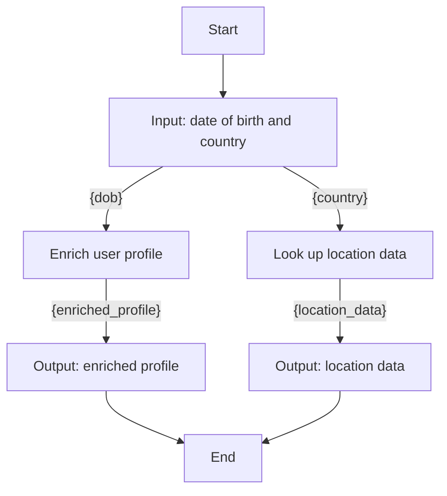

```mermaid
graph TD
    A[Start] --> B[Input: date of birth and country]
    B[Input: date of birth and country] -- {dob} --> C[Enrich user profile]
    B[Input: date of birth and country] -- {country} --> D[Look up location data]
    C[Enrich user profile] -- {enriched_profile} --> E[Output: enriched profile]
    D[Look up location data] -- {location_data} --> F[Output: location data]
    E[Output: enriched profile] --> G[End]
    F[Output: location data] --> G[End]
```