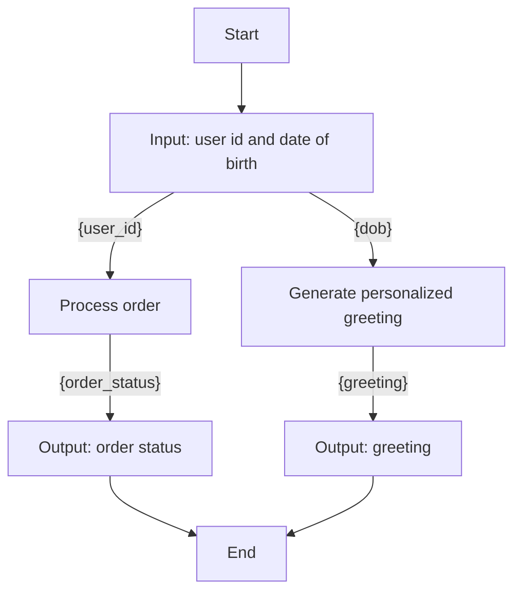

```mermaid
graph TD
    A[Start] --> B[Input: user id and date of birth]
    B[Input: user id and date of birth] -- {user_id} --> C[Process order]
    B[Input: user id and date of birth] -- {dob} --> D[Generate personalized greeting]
    C[Process order] -- {order_status} --> E[Output: order status]
    D[Generate personalized greeting] -- {greeting} --> F[Output: greeting]
    E[Output: order status] --> G[End]
    F[Output: greeting] --> G[End]
```