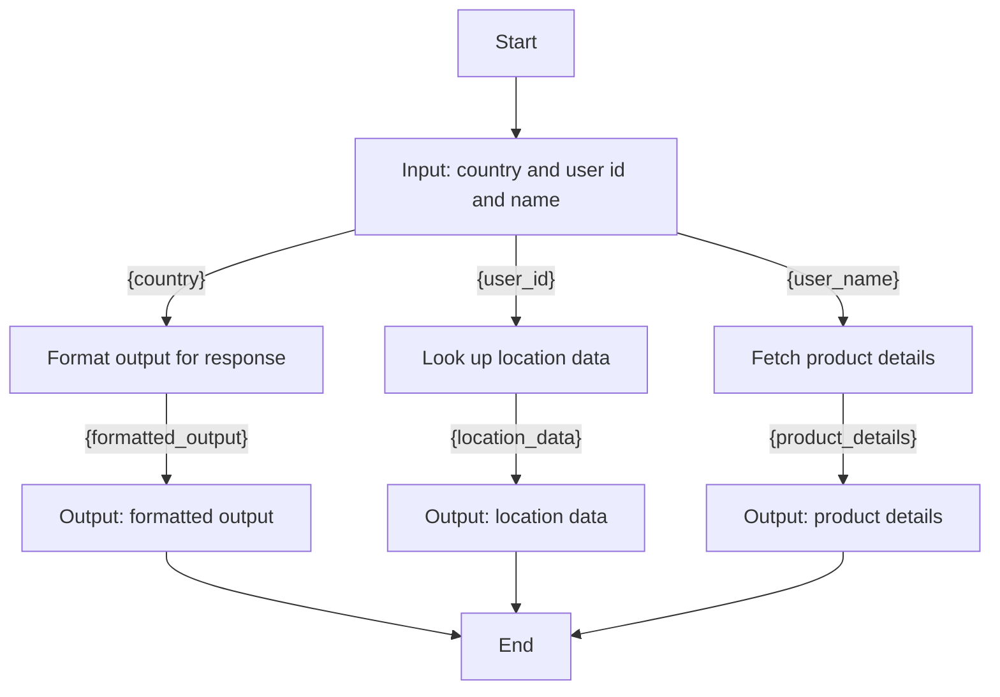

```mermaid
graph TD
    A[Start] --> B[Input: country and user id and name]
    B[Input: country and user id and name] -- {country} --> C[Format output for response]
    C[Format output for response] -- {formatted_output} --> D[Output: formatted output]
    D[Output: formatted output] --> I[End]
    B[Input: country and user id and name] -- {user_id} --> E[Look up location data]
    E[Look up location data] -- {location_data} --> F[Output: location data]
    F[Output: location data] --> I[End]
    B[Input: country and user id and name] -- {user_name} --> G[Fetch product details]
    G[Fetch product details] -- {product_details} --> H[Output: product details]
    H[Output: product details] --> I[End]
```