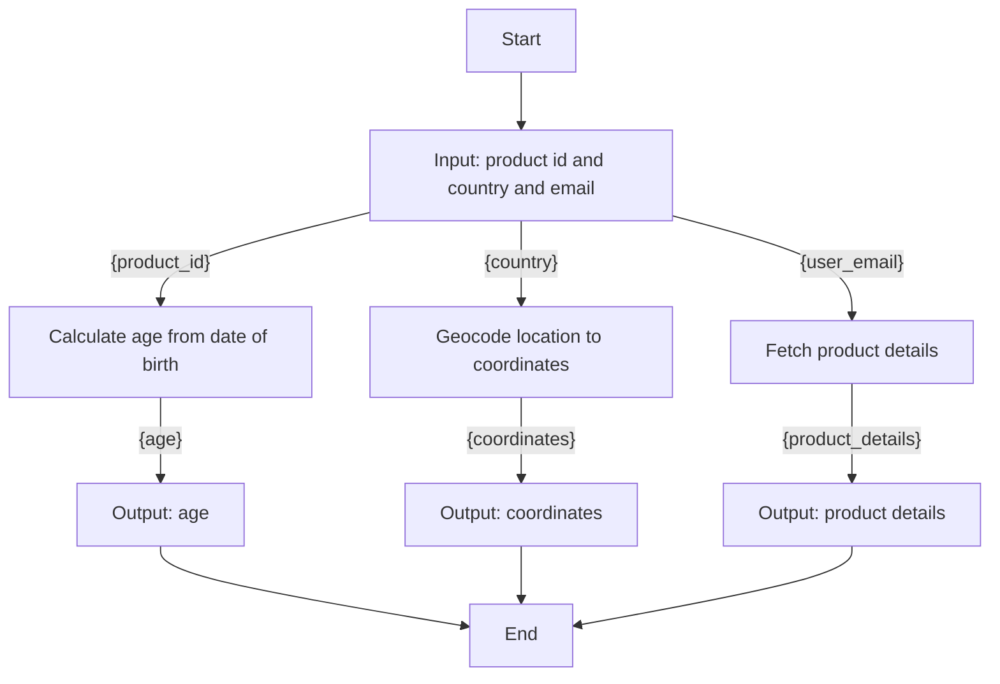

```mermaid
graph TD
    A[Start] --> B[Input: product id and country and email]
    B[Input: product id and country and email] -- {product_id} --> C[Calculate age from date of birth]
    C[Calculate age from date of birth] -- {age} --> D[Output: age]
    D[Output: age] --> I[End]
    B[Input: product id and country and email] -- {country} --> E[Geocode location to coordinates]
    E[Geocode location to coordinates] -- {coordinates} --> F[Output: coordinates]
    F[Output: coordinates] --> I[End]
    B[Input: product id and country and email] -- {user_email} --> G[Fetch product details]
    G[Fetch product details] -- {product_details} --> H[Output: product details]
    H[Output: product details] --> I[End]
```