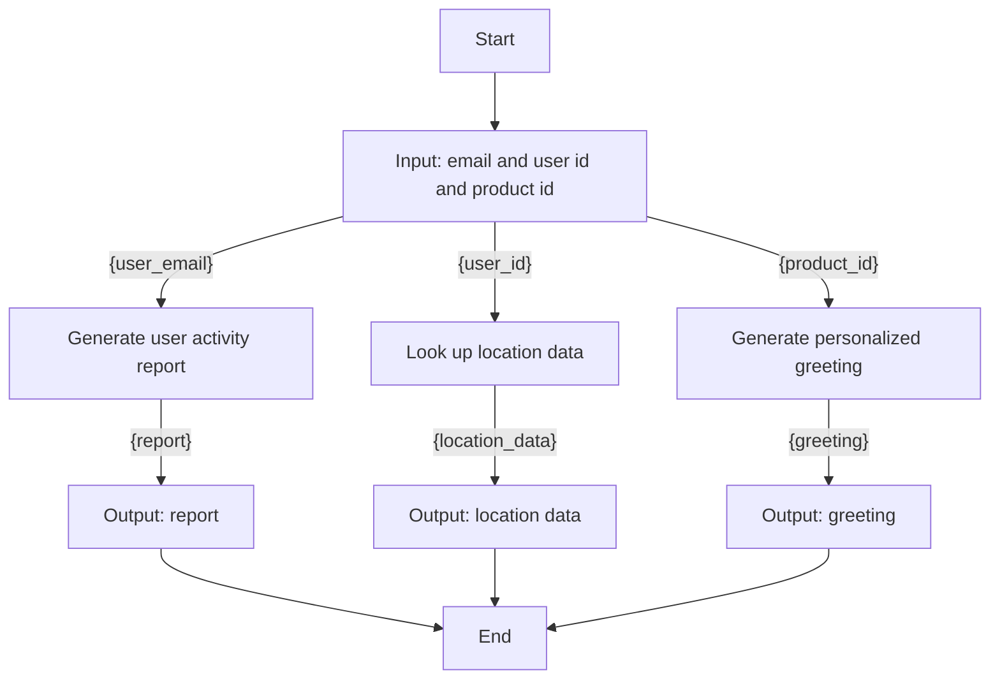

```mermaid
graph TD
    A[Start] --> B[Input: email and user id and product id]
    B[Input: email and user id and product id] -- {user_email} --> C[Generate user activity report]
    C[Generate user activity report] -- {report} --> D[Output: report]
    D[Output: report] --> I[End]
    B[Input: email and user id and product id] -- {user_id} --> E[Look up location data]
    E[Look up location data] -- {location_data} --> F[Output: location data]
    F[Output: location data] --> I[End]
    B[Input: email and user id and product id] -- {product_id} --> G[Generate personalized greeting]
    G[Generate personalized greeting] -- {greeting} --> H[Output: greeting]
    H[Output: greeting] --> I[End]
```