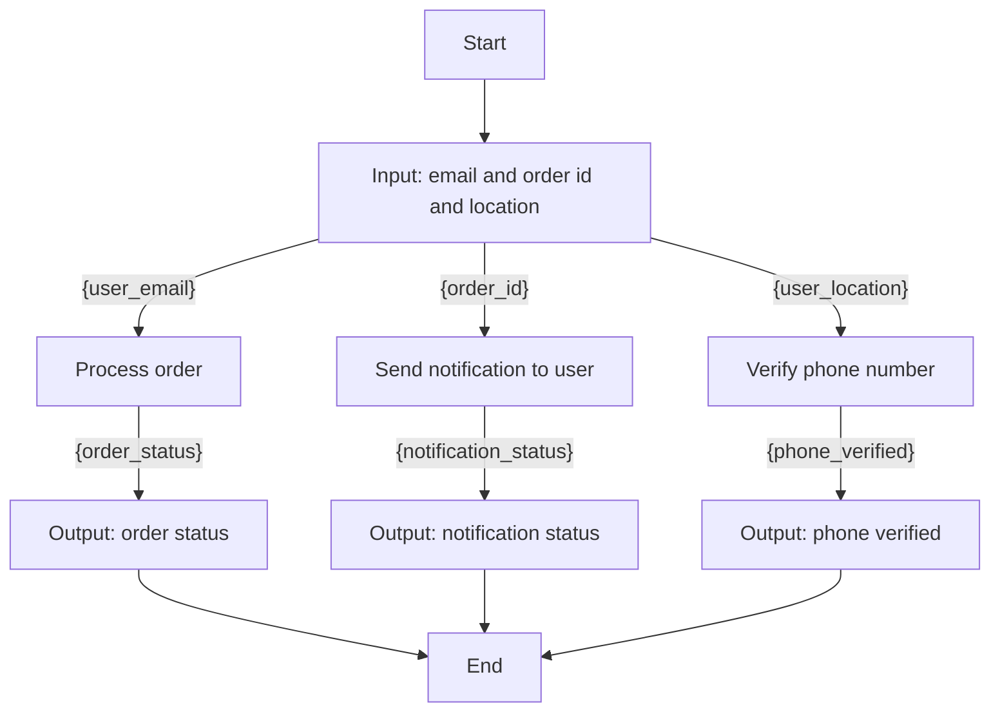

```mermaid
graph TD
    A[Start] --> B[Input: email and order id and location]
    B[Input: email and order id and location] -- {user_email} --> C[Process order]
    C[Process order] -- {order_status} --> D[Output: order status]
    D[Output: order status] --> I[End]
    B[Input: email and order id and location] -- {order_id} --> E[Send notification to user]
    E[Send notification to user] -- {notification_status} --> F[Output: notification status]
    F[Output: notification status] --> I[End]
    B[Input: email and order id and location] -- {user_location} --> G[Verify phone number]
    G[Verify phone number] -- {phone_verified} --> H[Output: phone verified]
    H[Output: phone verified] --> I[End]
```