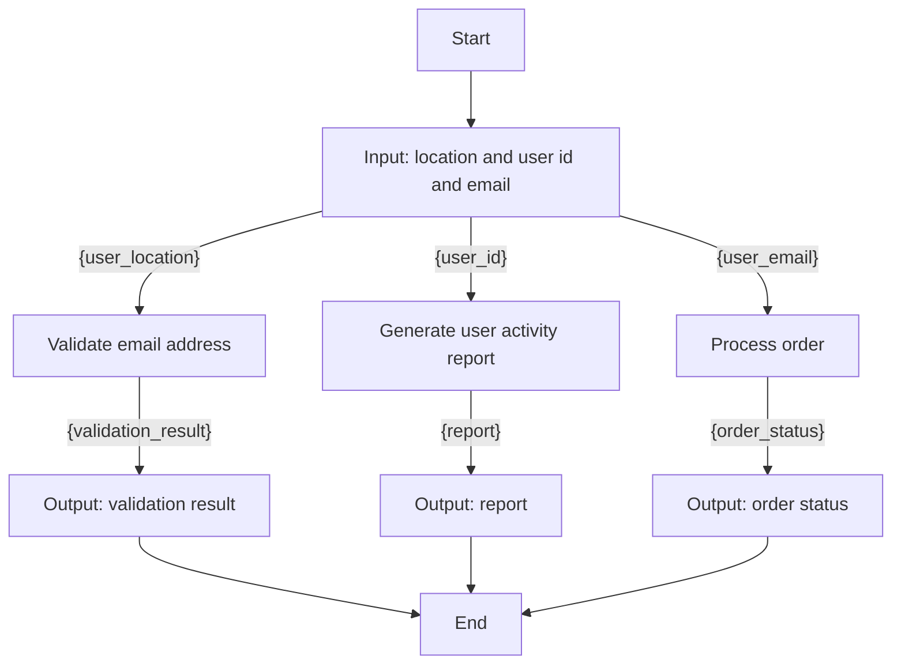

```mermaid
graph TD
    A[Start] --> B[Input: location and user id and email]
    B[Input: location and user id and email] -- {user_location} --> C[Validate email address]
    C[Validate email address] -- {validation_result} --> D[Output: validation result]
    D[Output: validation result] --> I[End]
    B[Input: location and user id and email] -- {user_id} --> E[Generate user activity report]
    E[Generate user activity report] -- {report} --> F[Output: report]
    F[Output: report] --> I[End]
    B[Input: location and user id and email] -- {user_email} --> G[Process order]
    G[Process order] -- {order_status} --> H[Output: order status]
    H[Output: order status] --> I[End]
```