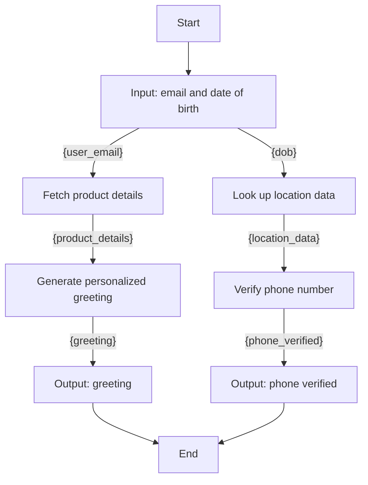

```mermaid
graph TD
    A[Start] --> B[Input: email and date of birth]
    B[Input: email and date of birth] -- {user_email} --> C[Fetch product details]
    C[Fetch product details] -- {product_details} --> D[Generate personalized greeting]
    D[Generate personalized greeting] -- {greeting} --> E[Output: greeting]
    E[Output: greeting] --> I[End]
    B[Input: email and date of birth] -- {dob} --> F[Look up location data]
    F[Look up location data] -- {location_data} --> G[Verify phone number]
    G[Verify phone number] -- {phone_verified} --> H[Output: phone verified]
    H[Output: phone verified] --> I[End]
```