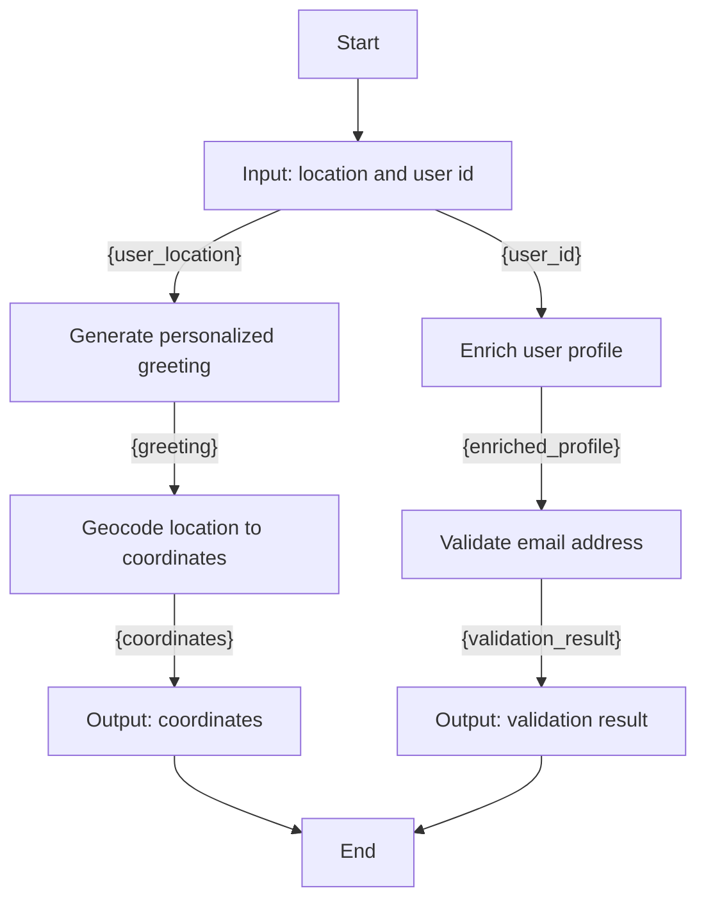

```mermaid
graph TD
    A[Start] --> B[Input: location and user id]
    B[Input: location and user id] -- {user_location} --> C[Generate personalized greeting]
    C[Generate personalized greeting] -- {greeting} --> D[Geocode location to coordinates]
    D[Geocode location to coordinates] -- {coordinates} --> E[Output: coordinates]
    E[Output: coordinates] --> I[End]
    B[Input: location and user id] -- {user_id} --> F[Enrich user profile]
    F[Enrich user profile] -- {enriched_profile} --> G[Validate email address]
    G[Validate email address] -- {validation_result} --> H[Output: validation result]
    H[Output: validation result] --> I[End]
```