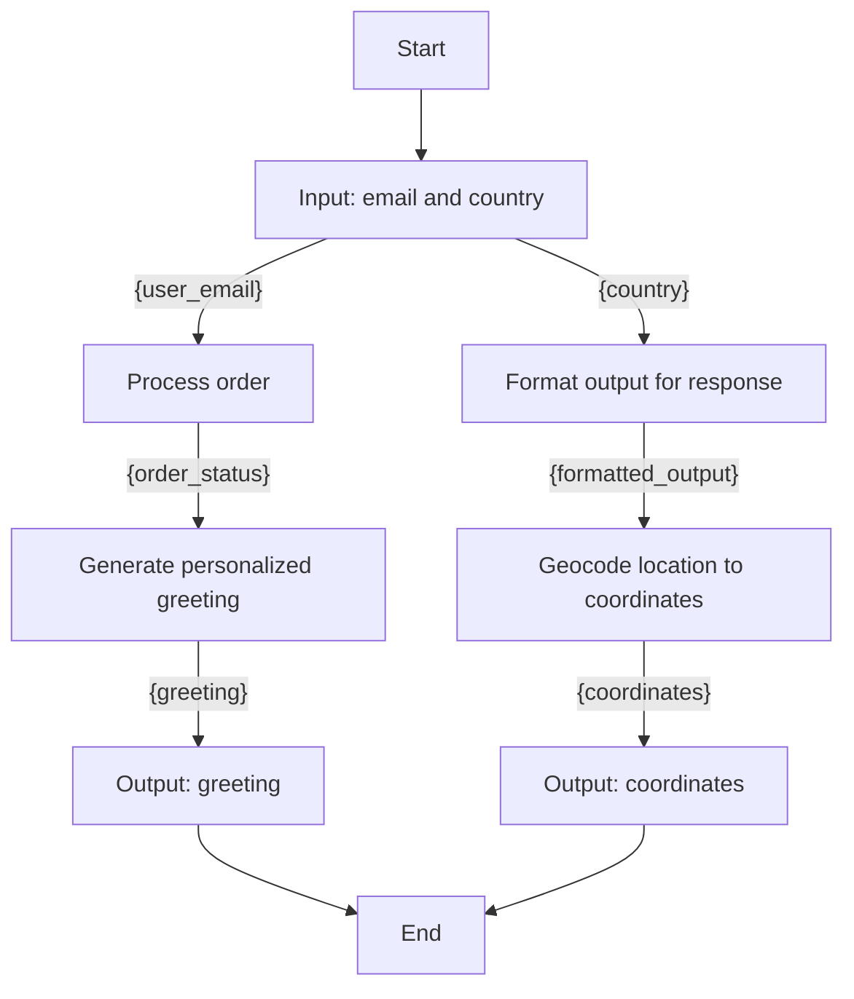

```mermaid
graph TD
    A[Start] --> B[Input: email and country]
    B[Input: email and country] -- {user_email} --> C[Process order]
    C[Process order] -- {order_status} --> D[Generate personalized greeting]
    D[Generate personalized greeting] -- {greeting} --> E[Output: greeting]
    E[Output: greeting] --> I[End]
    B[Input: email and country] -- {country} --> F[Format output for response]
    F[Format output for response] -- {formatted_output} --> G[Geocode location to coordinates]
    G[Geocode location to coordinates] -- {coordinates} --> H[Output: coordinates]
    H[Output: coordinates] --> I[End]
```