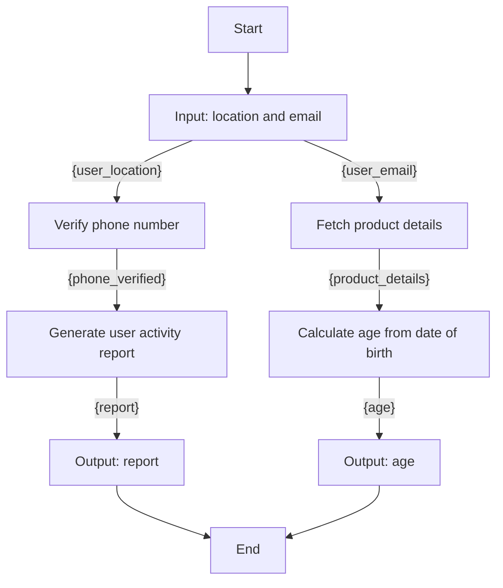

```mermaid
graph TD
    A[Start] --> B[Input: location and email]
    B[Input: location and email] -- {user_location} --> C[Verify phone number]
    C[Verify phone number] -- {phone_verified} --> D[Generate user activity report]
    D[Generate user activity report] -- {report} --> E[Output: report]
    E[Output: report] --> I[End]
    B[Input: location and email] -- {user_email} --> F[Fetch product details]
    F[Fetch product details] -- {product_details} --> G[Calculate age from date of birth]
    G[Calculate age from date of birth] -- {age} --> H[Output: age]
    H[Output: age] --> I[End]
```