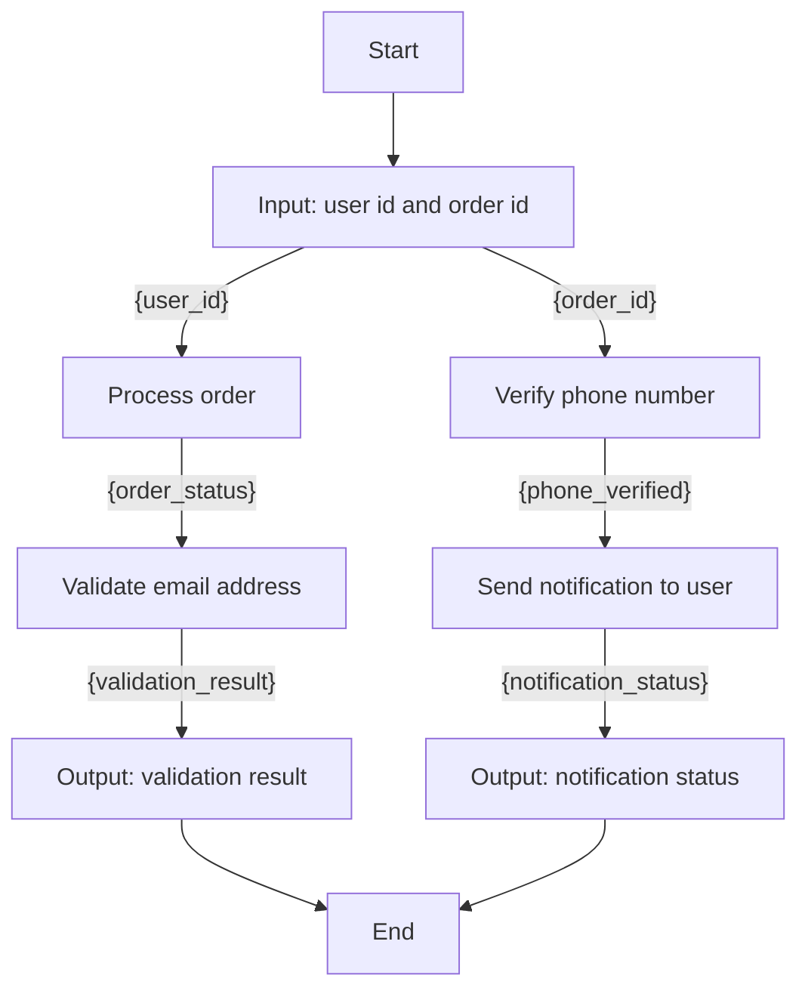

```mermaid
graph TD
    A[Start] --> B[Input: user id and order id]
    B[Input: user id and order id] -- {user_id} --> C[Process order]
    C[Process order] -- {order_status} --> D[Validate email address]
    D[Validate email address] -- {validation_result} --> E[Output: validation result]
    E[Output: validation result] --> I[End]
    B[Input: user id and order id] -- {order_id} --> F[Verify phone number]
    F[Verify phone number] -- {phone_verified} --> G[Send notification to user]
    G[Send notification to user] -- {notification_status} --> H[Output: notification status]
    H[Output: notification status] --> I[End]
```