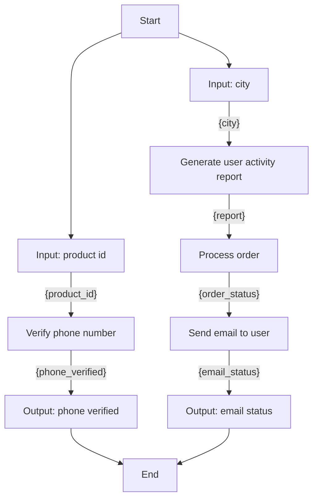

```mermaid
graph TD
    A[Start] --> B[Input: product id]
    B[Input: product id] -- {product_id} --> C[Verify phone number]
    C[Verify phone number] -- {phone_verified} --> D[Output: phone verified]
    D[Output: phone verified] --> J[End]
    A[Start] --> E[Input: city]
    E[Input: city] -- {city} --> F[Generate user activity report]
    F[Generate user activity report] -- {report} --> G[Process order]
    G[Process order] -- {order_status} --> H[Send email to user]
    H[Send email to user] -- {email_status} --> I[Output: email status]
    I[Output: email status] --> J[End]
```