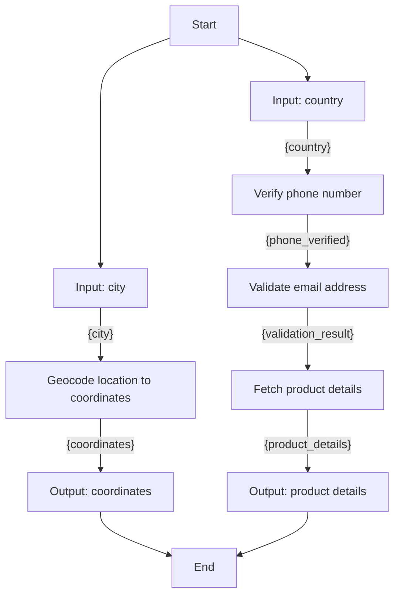

```mermaid
graph TD
    A[Start] --> B[Input: city]
    B[Input: city] -- {city} --> C[Geocode location to coordinates]
    C[Geocode location to coordinates] -- {coordinates} --> D[Output: coordinates]
    D[Output: coordinates] --> J[End]
    A[Start] --> E[Input: country]
    E[Input: country] -- {country} --> F[Verify phone number]
    F[Verify phone number] -- {phone_verified} --> G[Validate email address]
    G[Validate email address] -- {validation_result} --> H[Fetch product details]
    H[Fetch product details] -- {product_details} --> I[Output: product details]
    I[Output: product details] --> J[End]
```