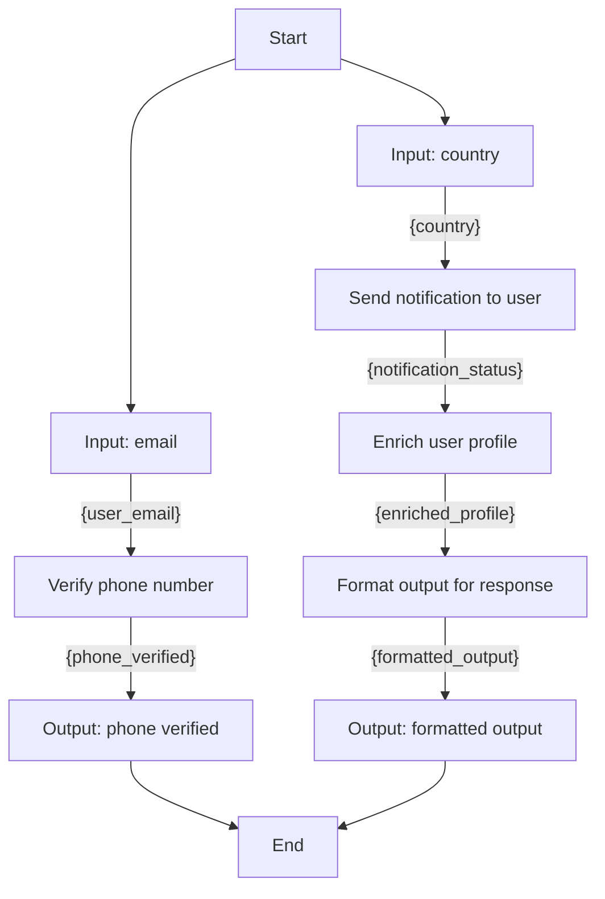

```mermaid
graph TD
    A[Start] --> B[Input: email]
    B[Input: email] -- {user_email} --> C[Verify phone number]
    C[Verify phone number] -- {phone_verified} --> D[Output: phone verified]
    D[Output: phone verified] --> J[End]
    A[Start] --> E[Input: country]
    E[Input: country] -- {country} --> F[Send notification to user]
    F[Send notification to user] -- {notification_status} --> G[Enrich user profile]
    G[Enrich user profile] -- {enriched_profile} --> H[Format output for response]
    H[Format output for response] -- {formatted_output} --> I[Output: formatted output]
    I[Output: formatted output] --> J[End]
```