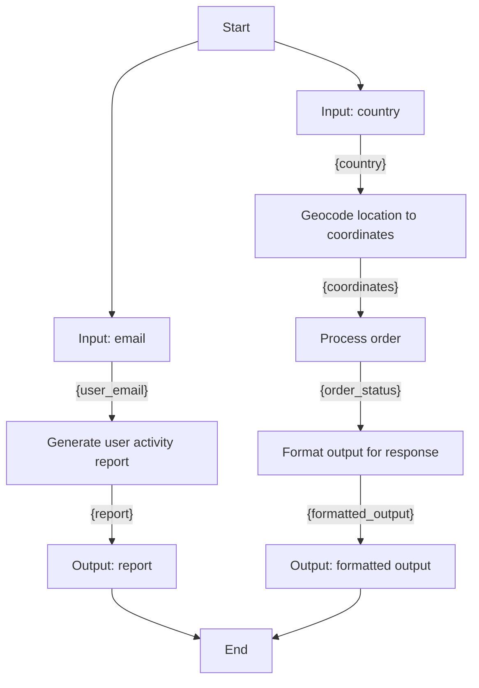

```mermaid
graph TD
    A[Start] --> B[Input: email]
    B[Input: email] -- {user_email} --> C[Generate user activity report]
    C[Generate user activity report] -- {report} --> D[Output: report]
    D[Output: report] --> J[End]
    A[Start] --> E[Input: country]
    E[Input: country] -- {country} --> F[Geocode location to coordinates]
    F[Geocode location to coordinates] -- {coordinates} --> G[Process order]
    G[Process order] -- {order_status} --> H[Format output for response]
    H[Format output for response] -- {formatted_output} --> I[Output: formatted output]
    I[Output: formatted output] --> J[End]
```