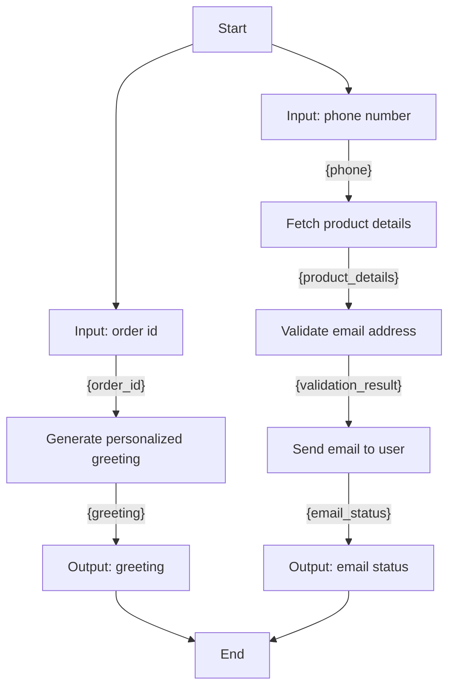

```mermaid
graph TD
    A[Start] --> B[Input: order id]
    B[Input: order id] -- {order_id} --> C[Generate personalized greeting]
    C[Generate personalized greeting] -- {greeting} --> D[Output: greeting]
    D[Output: greeting] --> J[End]
    A[Start] --> E[Input: phone number]
    E[Input: phone number] -- {phone} --> F[Fetch product details]
    F[Fetch product details] -- {product_details} --> G[Validate email address]
    G[Validate email address] -- {validation_result} --> H[Send email to user]
    H[Send email to user] -- {email_status} --> I[Output: email status]
    I[Output: email status] --> J[End]
```
