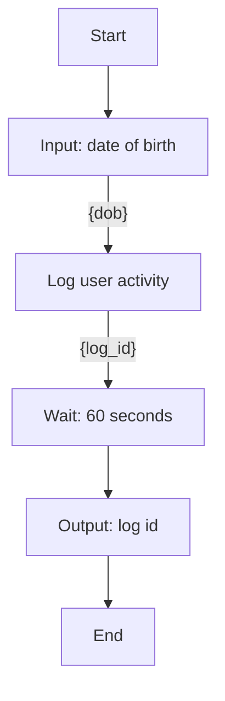

```mermaid
graph TD
    A[Start] --> B[Input: date of birth]
    B[Input: date of birth] -- {dob} --> C[Log user activity]
    C[Log user activity] -- {log_id} --> D[Wait: 60 seconds]
    D[Wait: 60 seconds] --> E[Output: log id]
    E[Output: log id] --> F[End]
```