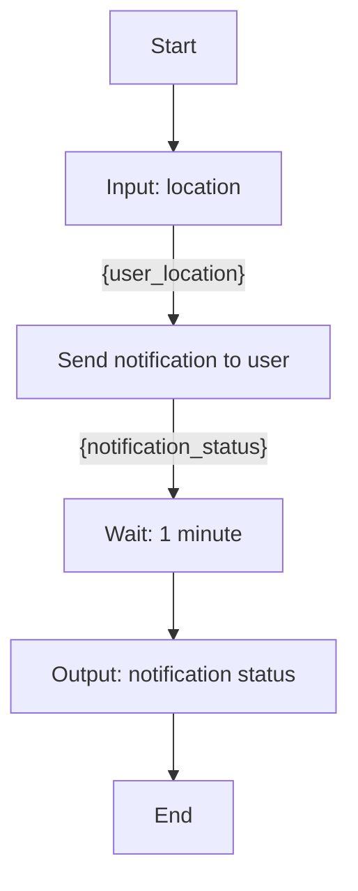

```mermaid
graph TD
    A[Start] --> B[Input: location]
    B[Input: location] -- {user_location} --> C[Send notification to user]
    C[Send notification to user] -- {notification_status} --> D[Wait: 1 minute]
    D[Wait: 1 minute] --> E[Output: notification status]
    E[Output: notification status] --> F[End]
```