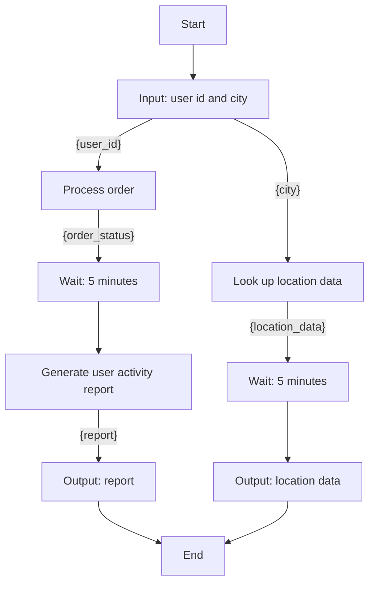

```mermaid
graph TD
    A[Start] --> B[Input: user id and city]
    B[Input: user id and city] -- {user_id} --> C[Process order]
    C[Process order] -- {order_status} --> D[Wait: 5 minutes]
    D[Wait: 5 minutes] --> E[Generate user activity report]
    E[Generate user activity report] -- {report} --> F[Output: report]
    F[Output: report] --> J[End]
    B[Input: user id and city] -- {city} --> G[Look up location data]
    G[Look up location data] -- {location_data} --> H[Wait: 5 minutes]
    H[Wait: 5 minutes] --> I[Output: location data]
    I[Output: location data] --> J[End]
```