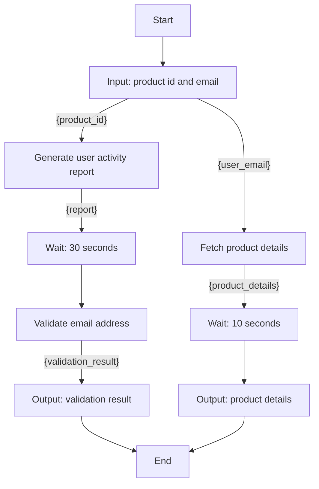

```mermaid
graph TD
    A[Start] --> B[Input: product id and email]
    B[Input: product id and email] -- {product_id} --> C[Generate user activity report]
    C[Generate user activity report] -- {report} --> D[Wait: 30 seconds]
    D[Wait: 30 seconds] --> E[Validate email address]
    E[Validate email address] -- {validation_result} --> F[Output: validation result]
    F[Output: validation result] --> J[End]
    B[Input: product id and email] -- {user_email} --> G[Fetch product details]
    G[Fetch product details] -- {product_details} --> H[Wait: 10 seconds]
    H[Wait: 10 seconds] --> I[Output: product details]
    I[Output: product details] --> J[End]
```