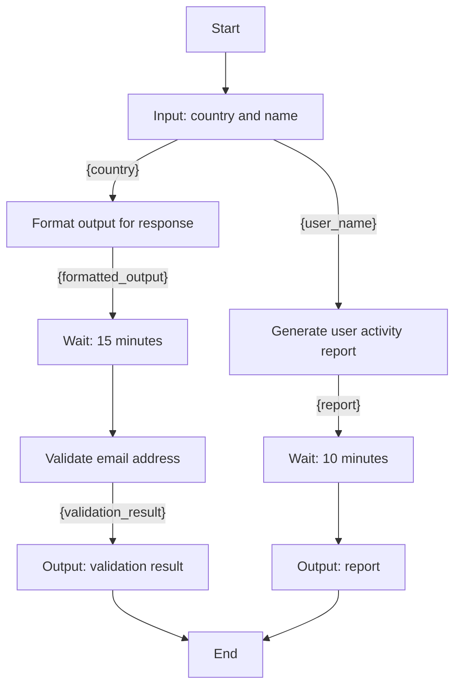

```mermaid
graph TD
    A[Start] --> B[Input: country and name]
    B[Input: country and name] -- {country} --> C[Format output for response]
    C[Format output for response] -- {formatted_output} --> D[Wait: 15 minutes]
    D[Wait: 15 minutes] --> E[Validate email address]
    E[Validate email address] -- {validation_result} --> F[Output: validation result]
    F[Output: validation result] --> J[End]
    B[Input: country and name] -- {user_name} --> G[Generate user activity report]
    G[Generate user activity report] -- {report} --> H[Wait: 10 minutes]
    H[Wait: 10 minutes] --> I[Output: report]
    I[Output: report] --> J[End]
```