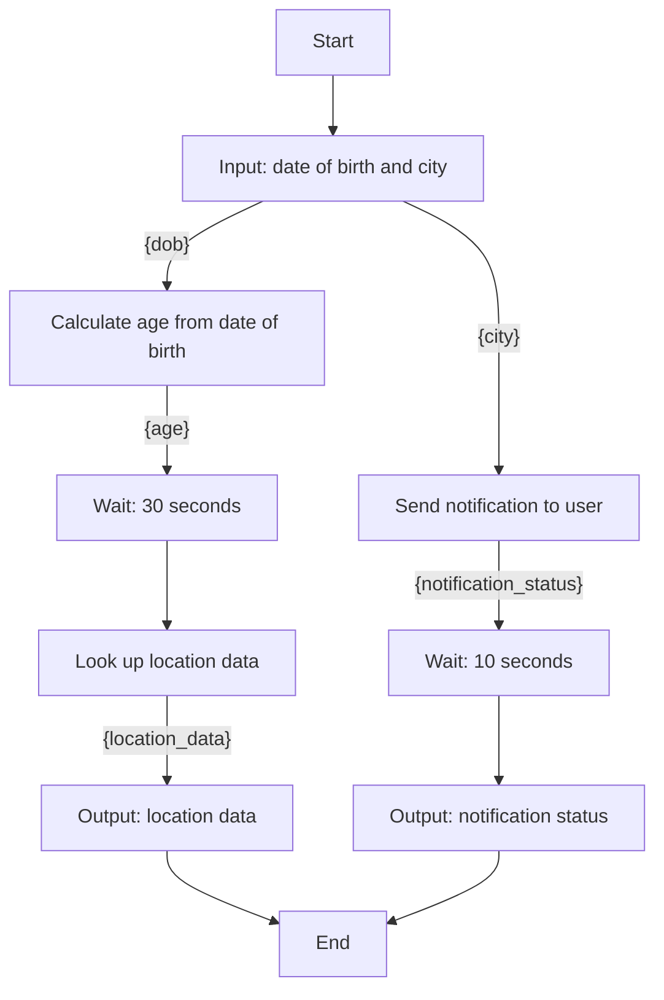

```mermaid
graph TD
    A[Start] --> B[Input: date of birth and city]
    B[Input: date of birth and city] -- {dob} --> C[Calculate age from date of birth]
    C[Calculate age from date of birth] -- {age} --> D[Wait: 30 seconds]
    D[Wait: 30 seconds] --> E[Look up location data]
    E[Look up location data] -- {location_data} --> F[Output: location data]
    F[Output: location data] --> J[End]
    B[Input: date of birth and city] -- {city} --> G[Send notification to user]
    G[Send notification to user] -- {notification_status} --> H[Wait: 10 seconds]
    H[Wait: 10 seconds] --> I[Output: notification status]
    I[Output: notification status] --> J[End]
```