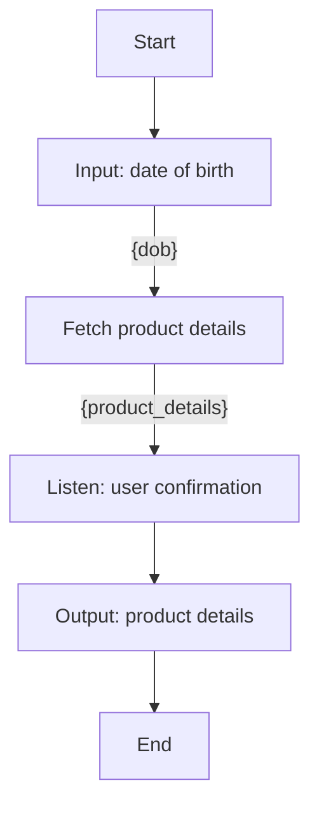

```mermaid
graph TD
    A[Start] --> B[Input: date of birth]
    B[Input: date of birth] -- {dob} --> C[Fetch product details]
    C[Fetch product details] -- {product_details} --> D[Listen: user confirmation]
    D[Listen: user confirmation] --> E[Output: product details]
    E[Output: product details] --> F[End]
```