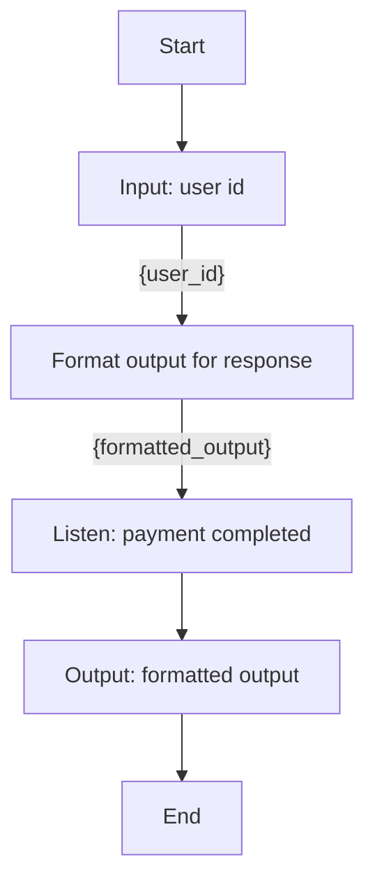

```mermaid
graph TD
    A[Start] --> B[Input: user id]
    B[Input: user id] -- {user_id} --> C[Format output for response]
    C[Format output for response] -- {formatted_output} --> D[Listen: payment completed]
    D[Listen: payment completed] --> E[Output: formatted output]
    E[Output: formatted output] --> F[End]
```