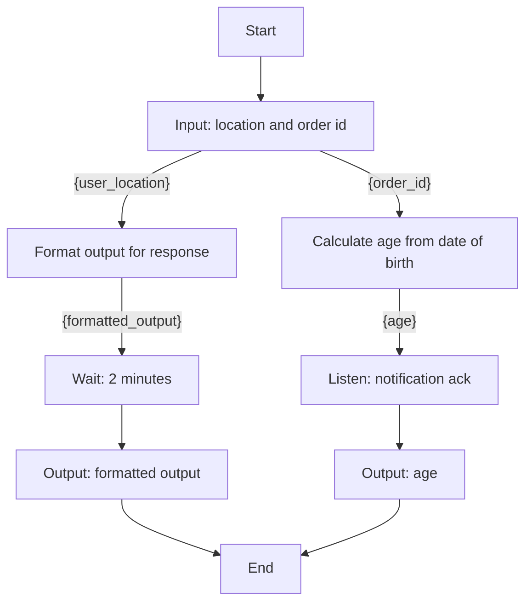

```mermaid
graph TD
    A[Start] --> B[Input: location and order id]
    B[Input: location and order id] -- {user_location} --> C[Format output for response]
    C[Format output for response] -- {formatted_output} --> D[Wait: 2 minutes]
    D[Wait: 2 minutes] --> E[Output: formatted output]
    E[Output: formatted output] --> I[End]
    B[Input: location and order id] -- {order_id} --> F[Calculate age from date of birth]
    F[Calculate age from date of birth] -- {age} --> G[Listen: notification ack]
    G[Listen: notification ack] --> H[Output: age]
    H[Output: age] --> I[End]
```