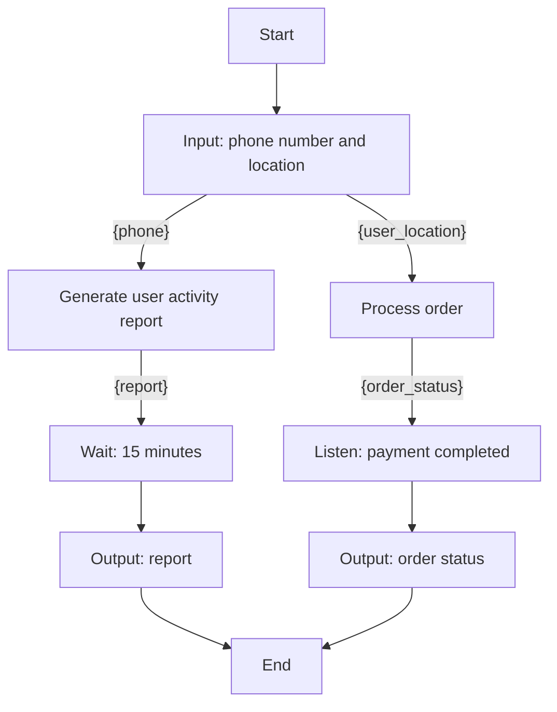

```mermaid
graph TD
    A[Start] --> B[Input: phone number and location]
    B[Input: phone number and location] -- {phone} --> C[Generate user activity report]
    C[Generate user activity report] -- {report} --> D[Wait: 15 minutes]
    D[Wait: 15 minutes] --> E[Output: report]
    E[Output: report] --> I[End]
    B[Input: phone number and location] -- {user_location} --> F[Process order]
    F[Process order] -- {order_status} --> G[Listen: payment completed]
    G[Listen: payment completed] --> H[Output: order status]
    H[Output: order status] --> I[End]
```