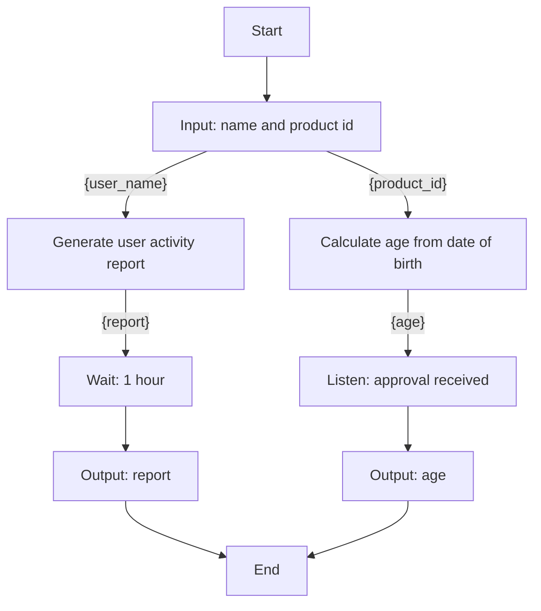

```mermaid
graph TD
    A[Start] --> B[Input: name and product id]
    B[Input: name and product id] -- {user_name} --> C[Generate user activity report]
    C[Generate user activity report] -- {report} --> D[Wait: 1 hour]
    D[Wait: 1 hour] --> E[Output: report]
    E[Output: report] --> I[End]
    B[Input: name and product id] -- {product_id} --> F[Calculate age from date of birth]
    F[Calculate age from date of birth] -- {age} --> G[Listen: approval received]
    G[Listen: approval received] --> H[Output: age]
    H[Output: age] --> I[End]
```