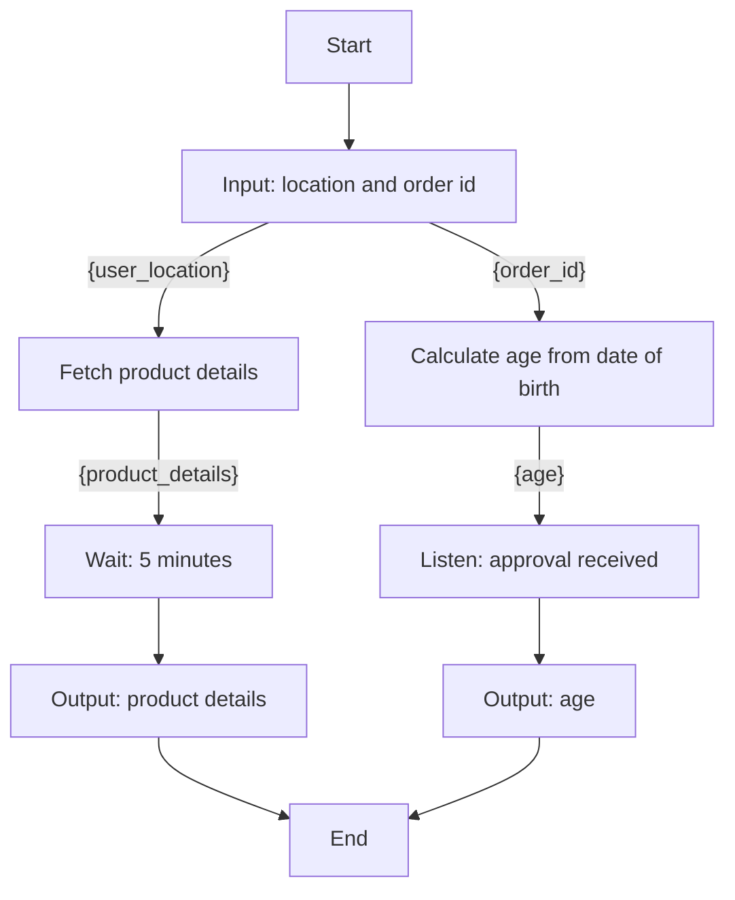

```mermaid
graph TD
    A[Start] --> B[Input: location and order id]
    B[Input: location and order id] -- {user_location} --> C[Fetch product details]
    C[Fetch product details] -- {product_details} --> D[Wait: 5 minutes]
    D[Wait: 5 minutes] --> E[Output: product details]
    E[Output: product details] --> I[End]
    B[Input: location and order id] -- {order_id} --> F[Calculate age from date of birth]
    F[Calculate age from date of birth] -- {age} --> G[Listen: approval received]
    G[Listen: approval received] --> H[Output: age]
    H[Output: age] --> I[End]
```